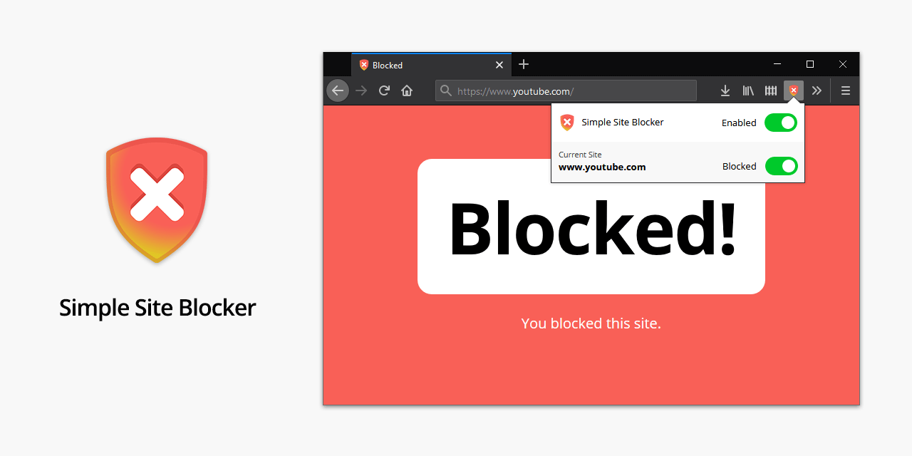

# Simple Site Blocker

[](https://travis-ci.org/b4rtaz/simple-site-blocker) [](/LICENSE) [](https://twitter.com/b4rtaz)

Block disturbing websites easily. Stay focused. This extension allows you to block any website in Firefox or Chrome. Please note that, the extension blocks the whole domain. When you want to take a break you may deactivate the blocking easily for all blocked sites.

This extension DOES NOT contain ads, tracking and premium. Your privacy is most important.

## ⏩ Download for Your Browser

⏩ [Mozilla Firefox](https://addons.mozilla.org/pl/firefox/addon/simplesiteblocker/)<br />
⏩ [Google Chrome](https://chrome.google.com/webstore/detail/simple-site-blocker/akhfampbeegijbknnencolmclbnaceab)

## ⚙️ How to Build

[Node.js](https://nodejs.org/en/) is required.

```
npm install
npm run make
```

## 🤝 Contributing

Contributions, issues and feature requests are welcome!

## 💡 License

This project is released under the MIT license.
